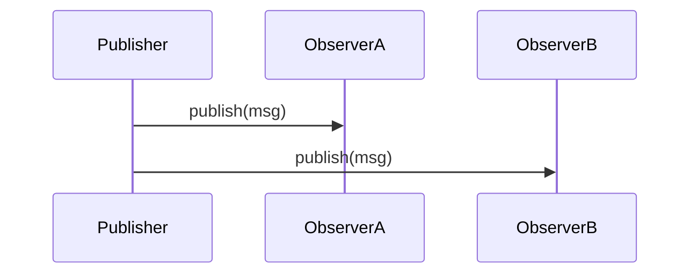

# Behavioral Patterns

This folder contains patterns that manage communication and responsibility among objects.

Files included: ChainOfResponsibility, Command, Interpreter, Iterator, Mediator, Memento, Observer, State, Strategy, TemplateMethod, Visitor

When to use each (short):
- Chain of Responsibility: pass a request along a chain until handled (e.g., support ticket routing, middleware pipelines).
- Command: encapsulate a request as an object (undo/redo, job queues, macro recording).
- Interpreter: interpret a language or expression (DSLs, search query parsing).
- Iterator: provide sequential access to elements (custom collections, streaming APIs).
- Mediator: centralize complex communication (chatroom, MVC controller coordinating UI components).
- Memento: capture and restore object state (undo in editors, transaction rollbacks).
- Observer: publish/subscribe event notification (event buses, UI binding).
- State: change object behavior when its state changes (network connection states, parser states).
- Strategy: swap algorithms at runtime (payment processors, caching strategies).
- Template Method: define skeleton of algorithm with overridable steps (data processing pipelines).
- Visitor: perform operations over collections of heterogeneous objects without modifying their classes (analytics, tax rules).

Mermaid (Observer flow):

Example scenario: Use Observer for decoupled event broadcasts — UI components subscribe to a model to update automatically when data changes.
