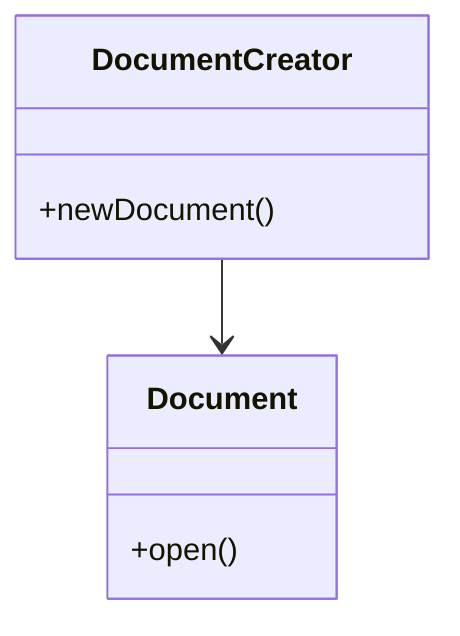

# Creational Patterns

This folder contains examples for creational design patterns: how objects are created.

Patterns included:
- `FactoryMethod.cpp` — choose concrete product at runtime
- `AbstractFactory.cpp` — families of related objects
- `Builder.cpp` — step-by-step construction of complex objects
- `Prototype.cpp` — clone existing instances
- `Singleton.cpp` — single shared instance

When to use each (short):
- Factory Method: when a class should defer instantiation to subclasses (e.g., document creation per department).
- Abstract Factory: when you need families of related products (e.g., cross-platform UI components).
- Builder: constructing complex objects with many parts (e.g., building a House or composing HTTP requests).
- Prototype: when creating new instances is expensive — clone a prototype with small variations.
- Singleton: shared access to resources (logger, config). Prefer dependency injection where possible.

Mermaid (Factory Method class collaboration):

Example scenario: A document processing app uses Factory Method to let different departments produce different document templates without changing the client code.
