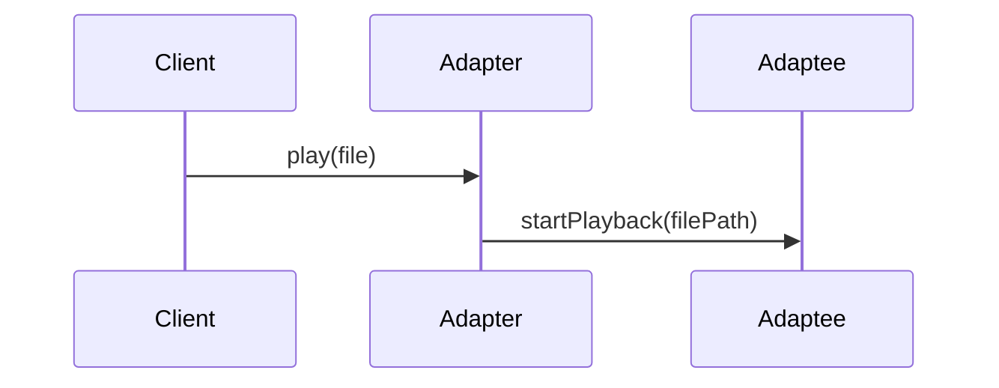

# Structural Patterns

Patterns in this folder help compose objects and classes to form larger structures.

Files:
- `Adapter.cpp`, `Bridge.cpp`, `Composite.cpp`, `Decorator.cpp`, `Facade.cpp`, `Flyweight.cpp`, `Proxy.cpp`

When to use each (short):
- Adapter: make incompatible interfaces work together (e.g., wrap a legacy media player so the app can use it).
- Bridge: separate abstraction from implementation (e.g., remote control abstractions vs concrete devices).
- Composite: represent part-whole hierarchies (file system trees, GUI components).
- Decorator: add responsibilities to objects dynamically (e.g., enriching output streams or UI components).
- Facade: provide a simpler API to a set of complex subsystems (e.g., media orchestration).
- Flyweight: share many fine-grained objects to save memory (text glyphs, particle systems).
- Proxy: control or defer access to an object (lazy loading, access control, caching).

Mermaid example (Adapter integration):

Scenario: Integrating a legacy audio/video library into a modern application without modifying the legacy code. Adapter wraps the legacy API and exposes the app-friendly interface.
